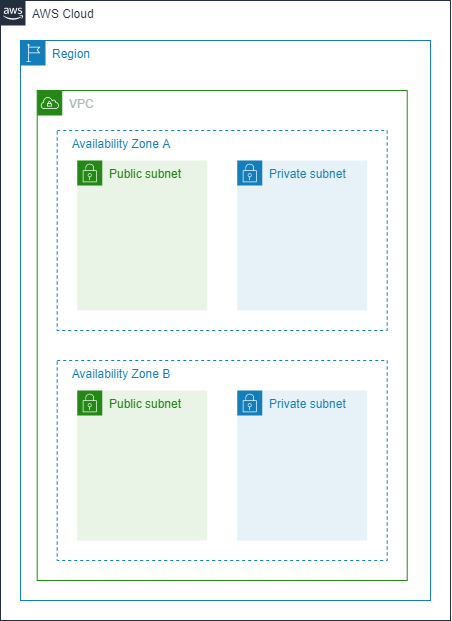
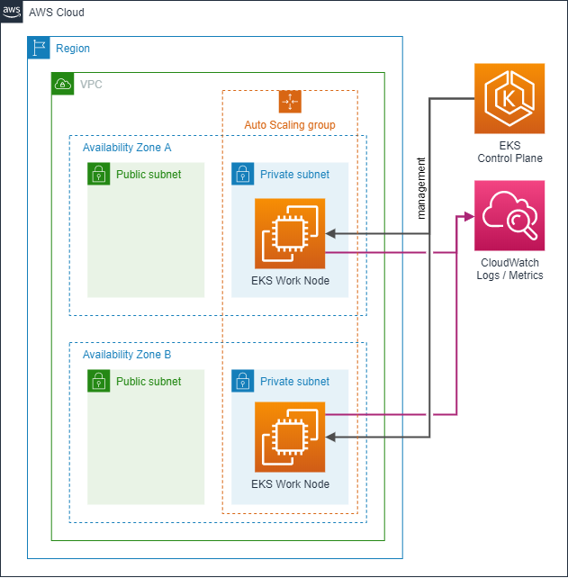
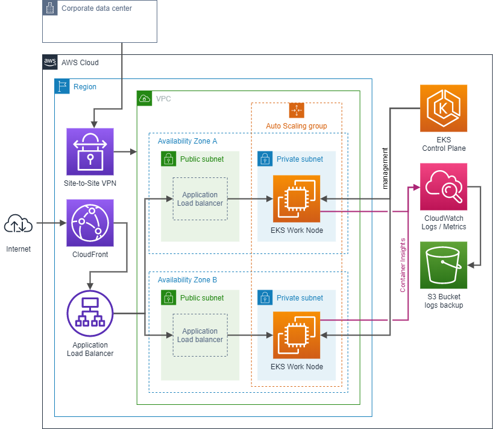

# Workshop - EKS

Estes são os arquivos da Terraform para trabalhar com a AWS.
Os dois projetos possuem diferentes focos, um é de apenas apresentar a rede no ambiente AWS e o outro de apresentar o `EKS`.

## Conceitos básicos

Antes de falarmos do Terraform e dos recursos da AWS, é importante que alguns conceitos estejam claros:

- **AWS CLI**: Utilizado para autenticar no ambiente AWS. É possível realizar a maior parte das ações disponíveis no Console AWS também pelo CLI.
- **Hashicorp Terraform**: Ferramenta que será utilizada para provisionar os recursos na nuvem AWS com Infraestrutura como Código.

## Observações

O workshop foi construído utilizando as seguintes versões:

- AWS CLI: 1.18.114
- Hashicorp Terraform: 0.12.29
- EKS: 1.17
___

## Generic Network

O objetivo deste módulo Terraform é apresentar os recursos de rede da AWS e como trabalhar com um ambiente otimizado para receber o `EKS` no futuro.

O código-fonte está localizado em: [./env/lab/generic-network](./env/lab/generic-network)

O Terraform criará os recursos apresentados acima. As principais observações são:

- **Multi-AZ**: A `VPC` possui pelo menos 2 `AZ` para garantir alta disponibilidade.
- **Private Subnet**: As subnets privadas são dedicadas para subir os workloads, sejam `EC2`, `Lambda`, `Fargate`, etc. Além disso, a rota padrão do `Route Table` redirecionará o tráfego para o `NAT Gateway` .
- **Public Subnet**: As subnets públicas serão utilizadas para colocar os `NAT Gateway` e os `Application Load Balancer (ALB)`.
- **NAT Gateway**: Recebe um IP público e cria uma saída NAT. Na prática, todo o workload colocado numa subnet privada possuirá apenas um IP público por AZ e provê melhor isolamento de rede.
___

## EKS

Com a rede criada, agora é possível criar o cluster `EKS`.

O objetivo deste módulo Terraform é criar os recursos de rede da AWS e apresentar os principais componentes do `EKS` e como eles se relacionam.

O código-fonte que inclui tanto o `EKS`, quanto a rede, está localizado em: [./env/lab/generic-network](./env/lab/eks)
cluster `EKS` ser provisionado.

O Terraform criará os seguinte recursos, além da rede:

- **EKS Control Plane**: Este é o principal componente do `EKS`. Engloba tudo que o `Kubernetes` precisa para funcionar, como o `kube-proxy`, `kubelet`, credentials, `etcd`. É necessário apenas definir a versão do Kuberentes e todo o resto a AWS é responsável por manter funcionando.
- **Work Nodes**: Instâncias `EC2` (também é possível utilizar instâncias `Fargate`) que serão provisionadas nas subnets privadas. Estas instâncias serão automaticamente ingressadas no cluster `EKS` e serão responsáveis por executar os containers do workload.
- **Launch Configuration**: Descreve tudo que é necessário para criar um instância `EC2` que será utilizada como `Work Node`.
- **Auto Scaling Group**: É responsável por provisionar, através do `Launch Configuration`, novos `Work Nodes`.
- **CloudWatch Events**: Eventos sobre scaling-in e scaling-out dos `Work Nodes`, além de outros eventos do `EKS` serão guardados aqui.
- **CloudWatch Logs**: Logs do `Control Plane` serão enviados para este recurso. É importante ressaltar que NÃO SÃO OS LOGS DOS CONTAINERS. No caso de querer enviar também os logs dos containers, será necessário instalar o `Container Insights for EKS` após a criação do cluster.
___

## EKS for production

Agora que todo o ambiente foi criado e você possui um `EKS` funcional, existem alguns pontos que devem ser considerados num ambiente produtivo. Este é um exemplo de arquitetura de um ambiente produtivo:

- **CloudFront**: É importante colocar uma camada na borda que fique responsável por receber e mitigar ataques DDoS ou mesmo ataques que ocorrem na camada 7. O `CloudFront`, por exemplo, possui recursos de `Web Application Firewall (WAF)`, além de se integrar com o `Amazon Shield`, caso seja necessário um nível de segurança maior. Apesar dos recursos de segurança, também oferece soluções de `CDN`, caso as aplicações do cluster `EKS` precise de otimização de entrega de artefatos estáticos ou precise oferecer grandes arquivos.
- **Application Load Balancer**: É um balanceador de carga que trabalha na camada 7 (aplicação) no protocolo HTTP e com suporte à TLS. Deve ser associado às subnets públicas caso o objetivo seja expor aplicações para a internet. Para utilizar em conjunto com o `EKS`, será necessário instalar o suporte para utilizar o Ingress em conjunto com o `ALB` após a criação do cluster.
- **Container Insights**: Precisa ser instalado no cluster `EKS` manualmente após a criação. Adiciona uma melhor integração com o `CloudWatch` e o workload em `EKS`. Talvez os dois melhores benefícios sejam a obtenção de métricas dos pods e os logs dos containers.
- **Site-to-Site VPN**: Para manter uma comunicação segura com o `EKS Control Plane` não é necessário o uso de VPN, pois existem outras soluções como MFA e tokens efêmeros para autentica no `IAM` e configurar o `kubectl`. Entretanto, se o objetivo é criar uma comunicação segurança entre os `Work Nodes` e a rede corporativa, será necessário criar uma VPN. A AWS oferece o recurso `Site-to-Site VPN` para este cenário.
- **S3 Bucket para backup**: Talvez seja importante manter um `S3 Bucket` para fazer backup dos logs que são capturados pelo `CloudWatch Logs`. Além de benefícios relacionados a compliance, permite a integração com outros recursos da AWS, como o `Athena` para fazer uma análise dos logs dos containers e identificar anomalias que podem não ter sido encontradas por ferramentas de APM, especialmente se for logs relacionados à regras de negócio.
